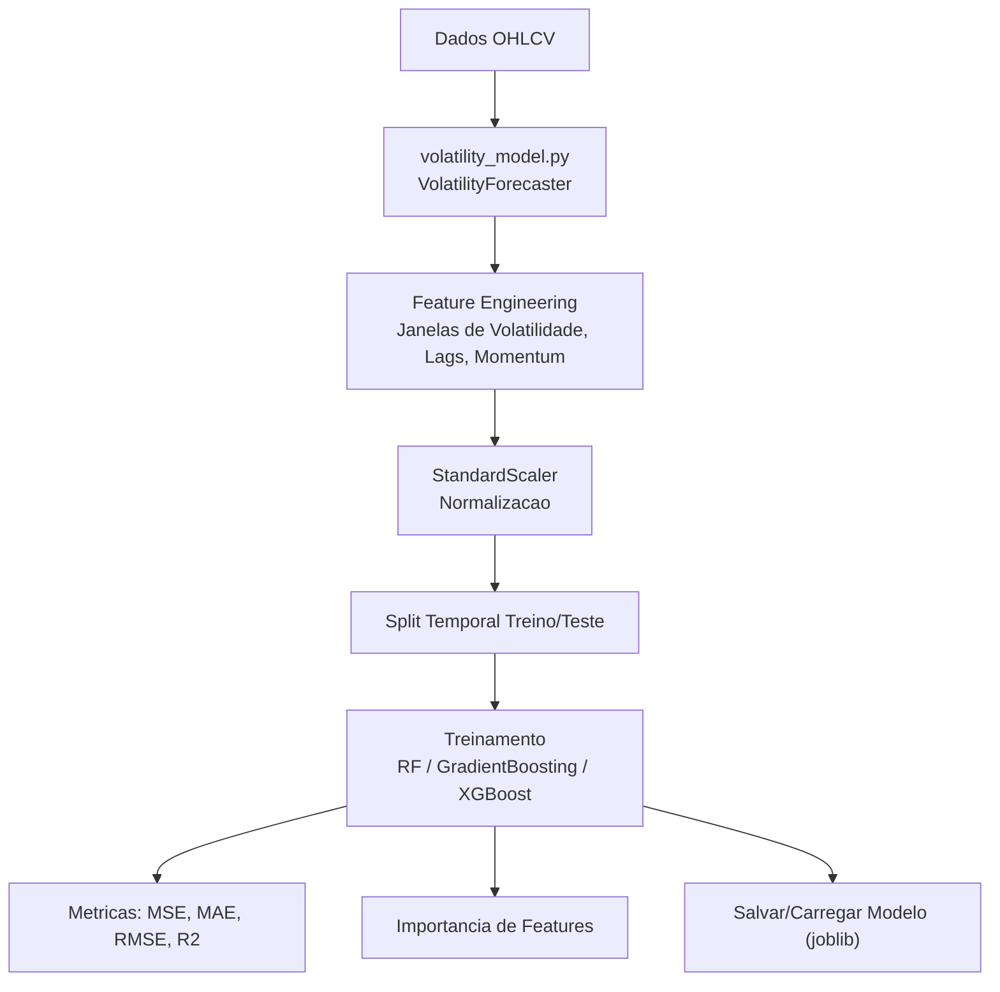
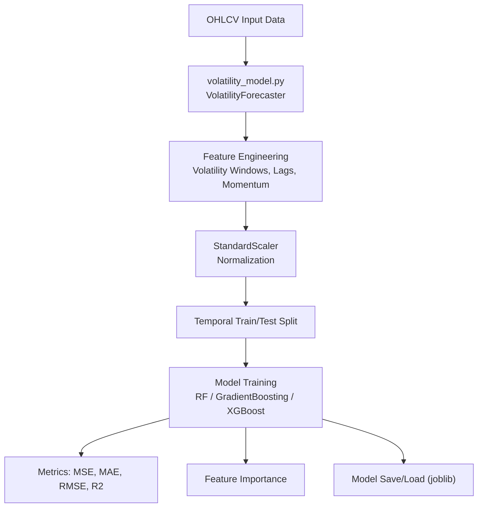

# ML Volatility Forecasting

Previsao de volatilidade em mercados financeiros usando Machine Learning (Random Forest, Gradient Boosting, XGBoost).

[](https://www.python.org/)
[](https://scikit-learn.org/)
[](https://xgboost.readthedocs.io/)
[](LICENSE)

[Portugues](#portugues) | [English](#english)

---

## Portugues

### Sobre

Modelo de Machine Learning para previsao de volatilidade realizada em series temporais financeiras. O projeto implementa uma classe `VolatilityForecaster` que:

- Calcula retornos logaritmicos e volatilidade realizada (desvio padrao rolante anualizado)
- Gera features automaticamente a partir de dados OHLCV: volatilidade historica em janelas multiplas (5, 10, 20, 30 dias), retornos defasados, retornos ao quadrado, momentum de preco, range high-low, features de volume e efeito dia da semana
- Treina modelos de regressao (Random Forest, Gradient Boosting ou XGBoost) para prever volatilidade futura
- Faz split temporal dos dados (sem data leakage)
- Normaliza features com StandardScaler
- Reporta metricas de treino e teste (MSE, MAE, RMSE, R2)
- Exporta importancia de features
- Permite salvar/carregar modelos treinados com joblib

### Como Usar

```bash
# Clonar o repositorio
git clone https://github.com/galafis/ml-volatility-forecasting.git
cd ml-volatility-forecasting

# Criar ambiente virtual
python -m venv venv
source venv/bin/activate  # Windows: venv\Scripts\activate

# Instalar dependencias
pip install -r requirements.txt

# Executar exemplo com dados sinteticos
python src/volatility_model.py

# Executar testes
pytest tests/ -v
```

### Uso Programatico

```python
from src.volatility_model import VolatilityForecaster, generate_sample_data

# Gerar dados de exemplo (ou usar seus proprios dados OHLCV)
df = generate_sample_data(1000)

# Treinar modelo
forecaster = VolatilityForecaster(model_type='xgboost')  # ou 'rf', 'gb'
metrics = forecaster.train(df, target_horizon=1, test_size=0.2)
print(metrics)

# Prever volatilidade
predictions = forecaster.predict(df.tail(30))

# Ver importancia das features
importance = forecaster.get_feature_importance()

# Salvar/carregar modelo
forecaster.save_model('modelo.joblib')
forecaster.load_model('modelo.joblib')
```

### Arquitetura



### Estrutura do Projeto

```
ml-volatility-forecasting/
├── src/
│   └── volatility_model.py   # Classe VolatilityForecaster + gerador de dados
├── tests/
│   ├── __init__.py
│   └── test_main.py          # 17 testes unitarios
├── requirements.txt
├── LICENSE
└── README.md
```

### Features Geradas

| Feature | Descricao |
|---------|-----------|
| `vol_Xd` | Volatilidade realizada em janelas de 5, 10, 20, 30 dias |
| `return_lag_X` | Retornos defasados (1, 2, 3, 5, 10 dias) |
| `squared_return` | Retorno ao quadrado (proxy de volatilidade) |
| `squared_return_maX` | Media movel do retorno ao quadrado |
| `momentum_X` | Momentum de preco em periodos de 5, 10, 20 dias |
| `hl_ratio` | Razao high-low / close (proxy de volatilidade intradiaria) |
| `volume_change` | Variacao percentual do volume |
| `volume_ma_ratio` | Razao volume / media movel de 20 dias |
| `day_of_week` | Dia da semana (efeito calendario) |

### Tecnologias

- **Python 3.12** — linguagem principal
- **pandas 2.2** — manipulacao de dados e series temporais
- **NumPy 1.26** — computacao numerica
- **scikit-learn 1.5** — modelos de ML, metricas e preprocessamento
- **XGBoost 2.1** — gradient boosting otimizado
- **joblib 1.4** — serializacao de modelos

### Limitacoes

- O exemplo embutido usa dados sinteticos com clustering de volatilidade estilo GARCH simplificado, nao dados reais de mercado
- Nao inclui API de servico ou deploy containerizado
- Nao implementa validacao cruzada temporal (walk-forward)
- O target (volatilidade realizada com `target_horizon=1`) usa janela curta e pode ser ruidoso

---

## English

### About

Machine Learning model for realized volatility forecasting in financial time series. The project implements a `VolatilityForecaster` class that:

- Calculates log returns and realized volatility (annualized rolling standard deviation)
- Automatically generates features from OHLCV data: historical volatility at multiple windows (5, 10, 20, 30 days), lagged returns, squared returns, price momentum, high-low range, volume features, and day-of-week effect
- Trains regression models (Random Forest, Gradient Boosting, or XGBoost) to predict future volatility
- Performs temporal train/test split (no data leakage)
- Normalizes features with StandardScaler
- Reports train and test metrics (MSE, MAE, RMSE, R2)
- Exports feature importance
- Supports saving/loading trained models with joblib

### Usage

```bash
# Clone the repository
git clone https://github.com/galafis/ml-volatility-forecasting.git
cd ml-volatility-forecasting

# Create virtual environment
python -m venv venv
source venv/bin/activate  # Windows: venv\Scripts\activate

# Install dependencies
pip install -r requirements.txt

# Run example with synthetic data
python src/volatility_model.py

# Run tests
pytest tests/ -v
```

### Programmatic Usage

```python
from src.volatility_model import VolatilityForecaster, generate_sample_data

# Generate sample data (or use your own OHLCV data)
df = generate_sample_data(1000)

# Train model
forecaster = VolatilityForecaster(model_type='xgboost')  # or 'rf', 'gb'
metrics = forecaster.train(df, target_horizon=1, test_size=0.2)
print(metrics)

# Predict volatility
predictions = forecaster.predict(df.tail(30))

# View feature importance
importance = forecaster.get_feature_importance()

# Save/load model
forecaster.save_model('model.joblib')
forecaster.load_model('model.joblib')
```

### Architecture



### Project Structure

```
ml-volatility-forecasting/
├── src/
│   └── volatility_model.py   # VolatilityForecaster class + data generator
├── tests/
│   ├── __init__.py
│   └── test_main.py          # 17 unit tests
├── requirements.txt
├── LICENSE
└── README.md
```

### Generated Features

| Feature | Description |
|---------|-------------|
| `vol_Xd` | Realized volatility at 5, 10, 20, 30-day windows |
| `return_lag_X` | Lagged returns (1, 2, 3, 5, 10 days) |
| `squared_return` | Squared return (volatility proxy) |
| `squared_return_maX` | Squared return moving average |
| `momentum_X` | Price momentum at 5, 10, 20-day periods |
| `hl_ratio` | High-low / close ratio (intraday volatility proxy) |
| `volume_change` | Volume percent change |
| `volume_ma_ratio` | Volume / 20-day moving average ratio |
| `day_of_week` | Day of week (calendar effect) |

### Technologies

- **Python 3.12** — core language
- **pandas 2.2** — data manipulation and time series
- **NumPy 1.26** — numerical computing
- **scikit-learn 1.5** — ML models, metrics, and preprocessing
- **XGBoost 2.1** — optimized gradient boosting
- **joblib 1.4** — model serialization

### Limitations

- The built-in example uses synthetic data with simplified GARCH-like volatility clustering, not real market data
- Does not include a serving API or containerized deployment
- Does not implement temporal cross-validation (walk-forward)
- The target (realized volatility with `target_horizon=1`) uses a short window and can be noisy

---

## Autor / Author

**Gabriel Demetrios Lafis**
- GitHub: [@galafis](https://github.com/galafis)
- LinkedIn: [Gabriel Demetrios Lafis](https://linkedin.com/in/gabriel-demetrios-lafis)

## Licenca / License

MIT License - veja [LICENSE](LICENSE) para detalhes / see [LICENSE](LICENSE) for details.
