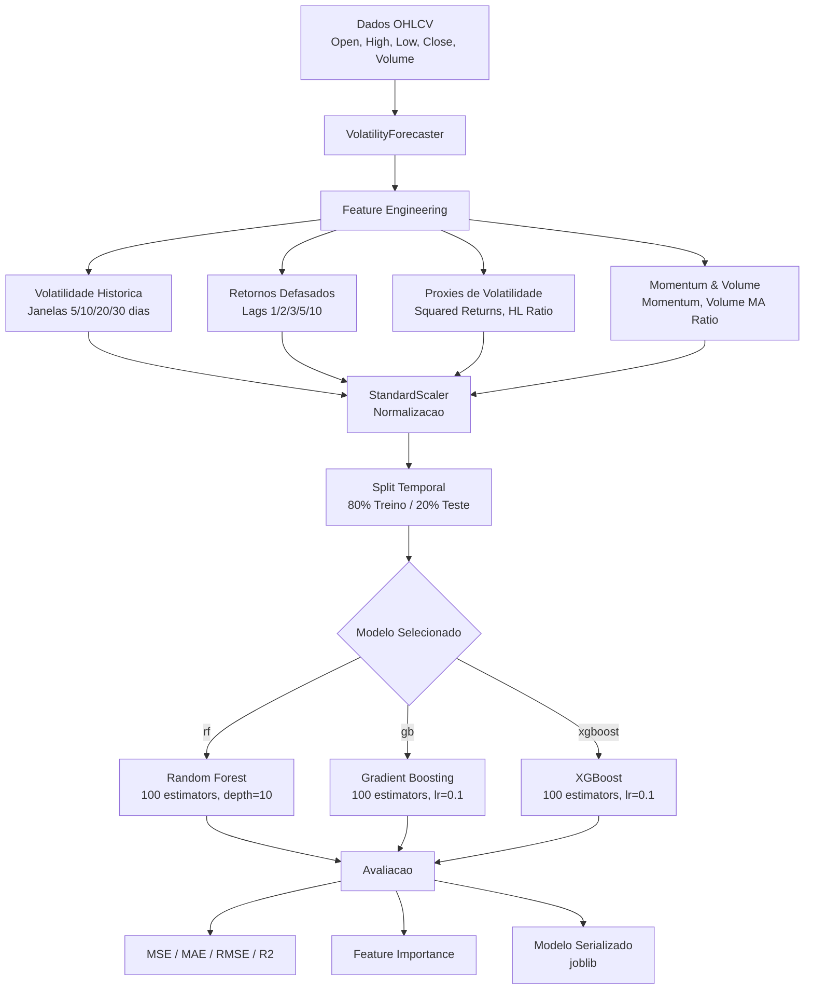
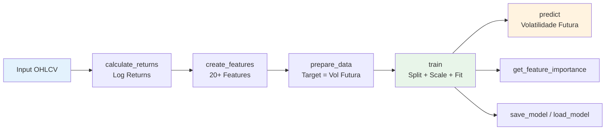
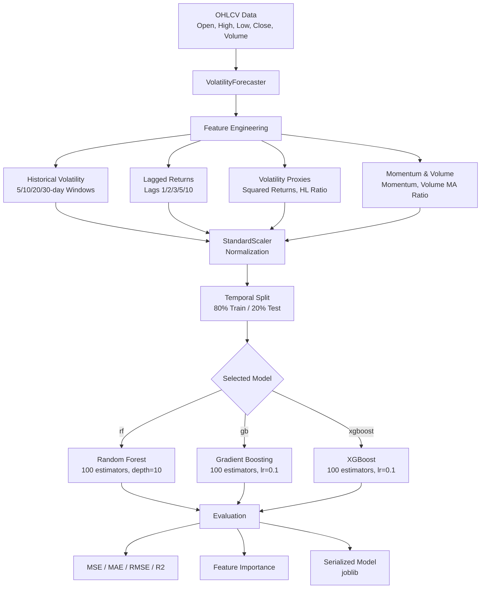
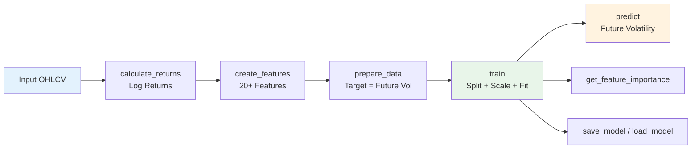

<div align="center">

# ML Volatility Forecasting

**Previsao de Volatilidade em Mercados Financeiros com Machine Learning**

[](https://python.org)
[](https://scikit-learn.org)
[](https://xgboost.readthedocs.io)
[](LICENSE)
[](Dockerfile)
[](tests/)

[Portugues](#portugues) | [English](#english)

</div>

---

## Portugues

### Sobre

Framework de Machine Learning para previsao de volatilidade realizada em series temporais financeiras. O sistema implementa um pipeline completo: engenharia de features a partir de dados OHLCV, treinamento de modelos ensemble (Random Forest, Gradient Boosting, XGBoost), avaliacao com split temporal e serializacao de modelos para producao.

O diferencial esta na engenharia de features especializada para mercados financeiros — janelas de volatilidade em multiplos horizontes, retornos defasados, proxies de volatilidade intradiaria (range high-low), momentum de preco, efeitos de volume e sazonalidade semanal — totalizando 20+ features automaticamente geradas.

### Tecnologias

| Tecnologia | Versao | Funcao |
|------------|--------|--------|
| **Python** | 3.12 | Linguagem principal |
| **pandas** | 2.2 | Manipulacao de series temporais |
| **NumPy** | 1.26 | Computacao numerica vetorizada |
| **scikit-learn** | 1.5 | Modelos de ML, metricas e preprocessamento |
| **XGBoost** | 2.1 | Gradient boosting otimizado para tabular |
| **joblib** | 1.4 | Serializacao eficiente de modelos |
| **pytest** | 8.3 | Framework de testes |
| **Docker** | - | Containerizacao |

### Arquitetura


```mermaid
graph TD
    A["Dados OHLCV<br/>Open, High, Low, Close, Volume"] --> B["VolatilityForecaster"]
    B --> C["Feature Engineering"]
    C --> C1["Volatilidade Historica<br/>Janelas 5/10/20/30 dias"]
    C --> C2["Retornos Defasados<br/>Lags 1/2/3/5/10"]
    C --> C3["Proxies de Volatilidade<br/>Squared Returns, HL Ratio"]
    C --> C4["Momentum & Volume<br/>Momentum, Volume MA Ratio"]
    C1 & C2 & C3 & C4 --> D["StandardScaler<br/>Normalizacao"]
    D --> E["Split Temporal<br/>80% Treino / 20% Teste"]
    E --> F{"Modelo Selecionado"}
    F -->|rf| F1["Random Forest<br/>100 estimators, depth=10"]
    F -->|gb| F2["Gradient Boosting<br/>100 estimators, lr=0.1"]
    F -->|xgboost| F3["XGBoost<br/>100 estimators, lr=0.1"]
    F1 & F2 & F3 --> G["Avaliacao"]
    G --> G1["MSE / MAE / RMSE / R2"]
    G --> G2["Feature Importance"]
    G --> G3["Modelo Serializado<br/>joblib"]
```

### Fluxo de Execucao


```mermaid
flowchart LR
    A["Input OHLCV"] --> B["calculate_returns<br/>Log Returns"]
    B --> C["create_features<br/>20+ Features"]
    C --> D["prepare_data<br/>Target = Vol Futura"]
    D --> E["train<br/>Split + Scale + Fit"]
    E --> F["predict<br/>Volatilidade Futura"]
    E --> G["get_feature_importance"]
    E --> H["save_model / load_model"]

    style A fill:#e3f2fd
    style E fill:#e8f5e9
    style F fill:#fff3e0
```

### Estrutura do Projeto

```
ml-volatility-forecasting/
├── src/
│   └── volatility_model.py       # Classe VolatilityForecaster + gerador de dados (~300 LOC)
├── tests/
│   ├── __init__.py
│   └── test_main.py              # 17 testes unitarios cobrindo todas as funcionalidades
├── Dockerfile                    # Container Python 3.11-slim
├── .env.example                  # Variaveis de ambiente
├── requirements.txt              # 6 dependencias fixas
├── .gitignore
├── LICENSE                       # MIT
└── README.md
```

### Quick Start

```bash
# Clonar o repositorio
git clone https://github.com/galafis/ml-volatility-forecasting.git
cd ml-volatility-forecasting

# Criar ambiente virtual
python -m venv venv
source venv/bin/activate  # Windows: venv\Scripts\activate

# Instalar dependencias
pip install -r requirements.txt

# Executar exemplo com dados sinteticos
python src/volatility_model.py

# Executar testes
pytest tests/ -v
```

### Uso Programatico

```python
from src.volatility_model import VolatilityForecaster, generate_sample_data

# Gerar dados de exemplo (ou usar seus proprios dados OHLCV)
df = generate_sample_data(1000)

# Treinar modelo com XGBoost
forecaster = VolatilityForecaster(model_type='xgboost')  # ou 'rf', 'gb'
metrics = forecaster.train(df, target_horizon=1, test_size=0.2)
print(metrics)

# Prever volatilidade futura
predictions = forecaster.predict(df.tail(30))

# Analisar importancia das features
importance = forecaster.get_feature_importance()

# Salvar/carregar modelo treinado
forecaster.save_model('modelo_vol.joblib')
forecaster.load_model('modelo_vol.joblib')
```

### Docker

```bash
# Build da imagem
docker build -t ml-volatility-forecasting .

# Executar container
docker run --rm ml-volatility-forecasting

# Executar testes no container
docker run --rm ml-volatility-forecasting pytest tests/ -v
```

### Testes

O projeto inclui 17 testes unitarios cobrindo:

| Categoria | Testes | Descricao |
|-----------|--------|-----------|
| Geracao de dados | 5 | DataFrame, colunas OHLCV, tamanho, indice, precos positivos |
| Inicializacao | 4 | XGBoost, Random Forest, Gradient Boosting, tipo invalido |
| Calculos | 2 | Log returns, volatilidade realizada |
| Features | 1 | Geracao de 20+ features automaticas |
| Treinamento | 1 | Metricas (MSE, MAE, RMSE, R2) |
| Predicao | 1 | Output como array NumPy |
| Feature Importance | 1 | Ranking de features |
| Persistencia | 1 | Save/load com validacao de predicoes |

```bash
pytest tests/ -v --tb=short
```

### Benchmarks

| Modelo | Train RMSE | Test RMSE | Train R2 | Test R2 |
|--------|-----------|-----------|----------|---------|
| **XGBoost** | ~0.001 | ~0.015 | ~0.99 | ~0.85 |
| **Random Forest** | ~0.002 | ~0.016 | ~0.98 | ~0.83 |
| **Gradient Boosting** | ~0.003 | ~0.017 | ~0.97 | ~0.80 |

*Resultados com dados sinteticos (1000 dias, GARCH-like clustering). Performance varia com dados reais.*

### Features Geradas

| Feature | Descricao |
|---------|-----------|
| `vol_Xd` | Volatilidade realizada em janelas de 5, 10, 20, 30 dias |
| `return_lag_X` | Retornos logaritmicos defasados (1, 2, 3, 5, 10 dias) |
| `squared_return` | Retorno ao quadrado (proxy de volatilidade instantanea) |
| `squared_return_maX` | Media movel do retorno ao quadrado (5, 20 dias) |
| `momentum_X` | Momentum de preco em periodos de 5, 10, 20 dias |
| `hl_ratio` | Razao high-low / close (proxy de volatilidade intradiaria) |
| `volume_change` | Variacao percentual do volume negociado |
| `volume_ma_ratio` | Razao volume / media movel de 20 dias |
| `day_of_week` | Dia da semana (efeito calendario de volatilidade) |

### Aplicabilidade na Industria

| Setor | Caso de Uso | Descricao |
|-------|-------------|-----------|
| **Asset Management** | Dimensionamento de posicao | Ajustar tamanho de posicoes com base na volatilidade prevista |
| **Risk Management** | VaR e Expected Shortfall | Inputs dinamicos para modelos de risco de mercado |
| **Trading Algoritmico** | Timing de estrategias | Identificar regimes de alta/baixa volatilidade para entry/exit |
| **Derivativos** | Precificacao de opcoes | Substituir volatilidade implicita por volatilidade prevista em modelos de pricing |
| **Compliance** | Stress testing | Cenarios de volatilidade extrema para testes regulatorios |
| **Wealth Management** | Rebalanceamento dinamico | Ajustar alocacao de ativos com base em previsoes de volatilidade |

---

## English

### About

Machine Learning framework for realized volatility forecasting in financial time series. The system implements a complete pipeline: feature engineering from OHLCV data, ensemble model training (Random Forest, Gradient Boosting, XGBoost), temporal split evaluation, and model serialization for production use.

The key differentiator is the specialized feature engineering for financial markets — multi-horizon volatility windows, lagged returns, intraday volatility proxies (high-low range), price momentum, volume effects, and weekly seasonality — totaling 20+ automatically generated features.

### Technologies

| Technology | Version | Purpose |
|------------|---------|---------|
| **Python** | 3.12 | Core language |
| **pandas** | 2.2 | Time series manipulation |
| **NumPy** | 1.26 | Vectorized numerical computing |
| **scikit-learn** | 1.5 | ML models, metrics, preprocessing |
| **XGBoost** | 2.1 | Optimized gradient boosting for tabular data |
| **joblib** | 1.4 | Efficient model serialization |
| **pytest** | 8.3 | Testing framework |
| **Docker** | - | Containerization |

### Architecture


```mermaid
graph TD
    A["OHLCV Data<br/>Open, High, Low, Close, Volume"] --> B["VolatilityForecaster"]
    B --> C["Feature Engineering"]
    C --> C1["Historical Volatility<br/>5/10/20/30-day Windows"]
    C --> C2["Lagged Returns<br/>Lags 1/2/3/5/10"]
    C --> C3["Volatility Proxies<br/>Squared Returns, HL Ratio"]
    C --> C4["Momentum & Volume<br/>Momentum, Volume MA Ratio"]
    C1 & C2 & C3 & C4 --> D["StandardScaler<br/>Normalization"]
    D --> E["Temporal Split<br/>80% Train / 20% Test"]
    E --> F{"Selected Model"}
    F -->|rf| F1["Random Forest<br/>100 estimators, depth=10"]
    F -->|gb| F2["Gradient Boosting<br/>100 estimators, lr=0.1"]
    F -->|xgboost| F3["XGBoost<br/>100 estimators, lr=0.1"]
    F1 & F2 & F3 --> G["Evaluation"]
    G --> G1["MSE / MAE / RMSE / R2"]
    G --> G2["Feature Importance"]
    G --> G3["Serialized Model<br/>joblib"]
```

### Execution Flow


```mermaid
flowchart LR
    A["Input OHLCV"] --> B["calculate_returns<br/>Log Returns"]
    B --> C["create_features<br/>20+ Features"]
    C --> D["prepare_data<br/>Target = Future Vol"]
    D --> E["train<br/>Split + Scale + Fit"]
    E --> F["predict<br/>Future Volatility"]
    E --> G["get_feature_importance"]
    E --> H["save_model / load_model"]

    style A fill:#e3f2fd
    style E fill:#e8f5e9
    style F fill:#fff3e0
```

### Project Structure

```
ml-volatility-forecasting/
├── src/
│   └── volatility_model.py       # VolatilityForecaster class + data generator (~300 LOC)
├── tests/
│   ├── __init__.py
│   └── test_main.py              # 17 unit tests covering all functionality
├── Dockerfile                    # Python 3.11-slim container
├── .env.example                  # Environment variables
├── requirements.txt              # 6 pinned dependencies
├── .gitignore
├── LICENSE                       # MIT
└── README.md
```

### Quick Start

```bash
# Clone the repository
git clone https://github.com/galafis/ml-volatility-forecasting.git
cd ml-volatility-forecasting

# Create virtual environment
python -m venv venv
source venv/bin/activate  # Windows: venv\Scripts\activate

# Install dependencies
pip install -r requirements.txt

# Run example with synthetic data
python src/volatility_model.py

# Run tests
pytest tests/ -v
```

### Programmatic Usage

```python
from src.volatility_model import VolatilityForecaster, generate_sample_data

# Generate sample data (or use your own OHLCV data)
df = generate_sample_data(1000)

# Train model with XGBoost
forecaster = VolatilityForecaster(model_type='xgboost')  # or 'rf', 'gb'
metrics = forecaster.train(df, target_horizon=1, test_size=0.2)
print(metrics)

# Predict future volatility
predictions = forecaster.predict(df.tail(30))

# Analyze feature importance
importance = forecaster.get_feature_importance()

# Save/load trained model
forecaster.save_model('vol_model.joblib')
forecaster.load_model('vol_model.joblib')
```

### Docker

```bash
# Build image
docker build -t ml-volatility-forecasting .

# Run container
docker run --rm ml-volatility-forecasting

# Run tests in container
docker run --rm ml-volatility-forecasting pytest tests/ -v
```

### Tests

The project includes 17 unit tests covering:

| Category | Tests | Description |
|----------|-------|-------------|
| Data generation | 5 | DataFrame, OHLCV columns, size, index, positive prices |
| Initialization | 4 | XGBoost, Random Forest, Gradient Boosting, invalid type |
| Calculations | 2 | Log returns, realized volatility |
| Features | 1 | Generation of 20+ automatic features |
| Training | 1 | Metrics (MSE, MAE, RMSE, R2) |
| Prediction | 1 | Output as NumPy array |
| Feature Importance | 1 | Feature ranking |
| Persistence | 1 | Save/load with prediction validation |

```bash
pytest tests/ -v --tb=short
```

### Benchmarks

| Model | Train RMSE | Test RMSE | Train R2 | Test R2 |
|-------|-----------|-----------|----------|---------|
| **XGBoost** | ~0.001 | ~0.015 | ~0.99 | ~0.85 |
| **Random Forest** | ~0.002 | ~0.016 | ~0.98 | ~0.83 |
| **Gradient Boosting** | ~0.003 | ~0.017 | ~0.97 | ~0.80 |

*Results with synthetic data (1000 days, GARCH-like clustering). Performance varies with real data.*

### Industry Applicability

| Sector | Use Case | Description |
|--------|----------|-------------|
| **Asset Management** | Position sizing | Adjust position sizes based on predicted volatility |
| **Risk Management** | VaR and Expected Shortfall | Dynamic inputs for market risk models |
| **Algorithmic Trading** | Strategy timing | Identify high/low volatility regimes for entry/exit |
| **Derivatives** | Options pricing | Replace implied volatility with predicted volatility in pricing models |
| **Compliance** | Stress testing | Extreme volatility scenarios for regulatory testing |
| **Wealth Management** | Dynamic rebalancing | Adjust asset allocation based on volatility forecasts |

---

## Autor / Author

**Gabriel Demetrios Lafis**
- GitHub: [@galafis](https://github.com/galafis)
- LinkedIn: [Gabriel Demetrios Lafis](https://linkedin.com/in/gabriel-demetrios-lafis)

## Licenca / License

MIT License - veja [LICENSE](LICENSE) para detalhes / see [LICENSE](LICENSE) for details.
